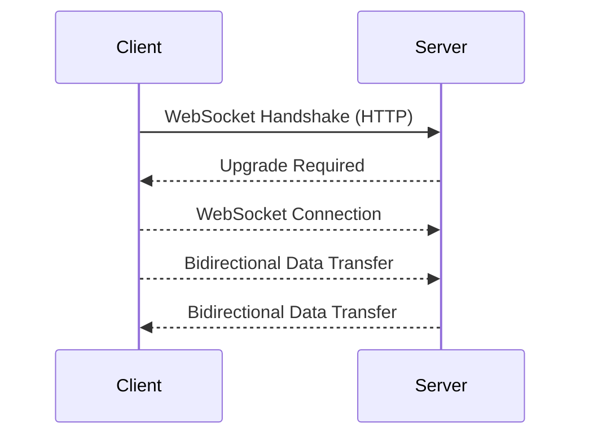
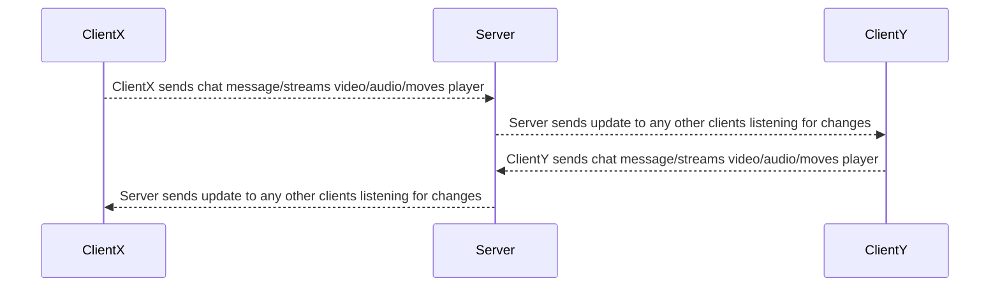

# What are WebSockets?
WebSockets are a communication protocol that enables bidirectional, full-duplex communication between clients (such as web browsers) and servers over a single, persistent TCP connection. They facilitate real-time data exchange and are commonly used in applications that require instant updates and low-latency communication.

1. **WebSocket Handshake (HTTP):** The WebSocket connection begins with a handshake between the client and server, initiated through an HTTP request. This handshake involves negotiating the WebSocket protocol upgrade.
2. **WebSocket Connection:** Once the handshake is completed and the connection is established, the protocol switches to a WebSocket connection. This connection remains open for the duration of the session.
3. **Bidirectional Data Transfer:** With the WebSocket connection established, both the client and server can send messages to each other at any time, without waiting for a request from the other party. This bidirectional communication allows for real-time data exchange.

### For more detailed information about the websocket protocol and standard, please see the below resources

- [RFC 6455 The WebSocket Protocol IETF](https://datatracker.ietf.org/doc/html/rfc6455)
- [WebSockets Living Standard](https://websockets.spec.whatwg.org/)

&nbsp;

# What are WebSockets used for?
WebSockets are employed in various applications requiring real-time communication and low-latency data transfer. Below are some common use cases:

1. **Real-time Chat Applications:** WebSockets are ideal for chat applications where users need to exchange messages instantly. With WebSockets, messages can be sent and received in real-time, providing a seamless chatting experience.
2. **Live Data Streaming:** WebSockets are utilized to stream live data (e.g., stock prices, weather updates) to clients in real-time. This enables users to receive continuous updates without the need to refresh the page.
3. **Multiplayer Online Games:** WebSockets find extensive usage in multiplayer online games to facilitate real-time communication between players and the game server. This allows players to interact with each other and see updates instantly as they occur in the game world.

&nbsp;

# What are some popular WS libraries for Node.js?

1. **Socket.IO** (JavaScript/Node.js):
Socket.IO is a JavaScript library for real-time web applications. It enables bidirectional communication between web clients and servers and offers features like multiplexing, broadcasting, and automatic reconnection.
    - Website: [Socket.IO](https://socket.io/)
    - GitHub: [socketio/socket.io](https://github.com/socketio/socket.io)
  

https://github.com/gitairman/websockets-article/assets/97379449/bbc66193-f809-4ebb-b5a3-13305685a395

2. **WebSocket-Node** (JavaScript/Node.js):
WebSocket-Node is a WebSocket implementation for Node.js. It provides a simple API for working with WebSocket connections in server-side Node.js applications.
    - GitHub: [websocket/websocket-node](https://github.com/websocket/websocket-node)

3. **ws** (JavaScript/Node.js):
ws is a lightweight WebSocket library for Node.js. It is simple, fast, and easy to use, making it a popular choice for WebSocket communication in Node.js applications.
    - GitHub: [websockets/ws](https://github.com/websockets/ws)

&nbsp;

# What are some popular managed WS solution providers?

1. **Pusher**:
Pusher is a hosted service that provides APIs and libraries for adding real-time functionality to web and mobile applications. It offers features like real-time event streaming, presence channels, and push notifications.
    - Website: [Pusher](https://pusher.com/)
    - GitHub: [pusher](https://github.com/pusher)

2. **PieHost**:
PieSocket is a managed WebSocket service that offers real-time messaging capabilities for web applications. It provides features like message broadcasting, presence detection, and analytics.
    - Website: [PieHost](https://www.piehost.com/)
    - GitHub: N/A

3. **Ably**:
Ably is a real-time data delivery platform that provides scalable and reliable messaging APIs for building distributed and collaborative applications. It offers features like pub/sub messaging, presence, and message history.
    - Website: [Ably](https://www.ably.io/)
    - GitHub: [ably/ably-js](https://github.com/ably/ably-js)

&nbsp;

# What are the differences between a library like socket.io and a managed solution provider like Pusher?

Socket.IO and Pusher are both technologies used for real-time communication in web applications, but they have some conceptual differences:

**Hosting:**
- **Socket.IO:** Socket.IO is typically self-hosted, meaning developers deploy and manage their own WebSocket servers using the Socket.IO library. This gives developers more control over the infrastructure but requires them to handle server deployment and maintenance.
- **Pusher:** Pusher is a hosted service provided by Pusher Limited. It offers a cloud-based infrastructure for managing real-time communication, eliminating the need for developers to deploy and manage their own servers.

**Protocol:**
- **Socket.IO:** Socket.IO is built on top of the WebSocket protocol but provides additional features and enhancements, such as automatic reconnection, multiplexing, and support for fallback mechanisms like polling and long-polling. It aims to provide a reliable and flexible solution for real-time communication.
- **Pusher:** Pusher primarily uses the WebSocket protocol for real-time communication but also offers fallback mechanisms for environments where WebSocket connections are not supported. It provides features like presence channels, push notifications, and event streaming.

**Scalability:**
- **Socket.IO:** Socket.IO is designed to be scalable, and developers can deploy multiple Socket.IO instances to handle increased traffic. However, scaling Socket.IO servers requires manual configuration and management of server instances.
- **Pusher:** Pusher offers a fully managed infrastructure that automatically scales resources based on demand. It ensures high availability and reliability for real-time communication without requiring developers to manage server scaling.

**Ease of Use:**
- **Socket.IO:** Socket.IO provides a user-friendly API and client libraries for various programming languages, making it easy to integrate real-time functionality into applications. Developers have control over the server-side implementation and can customize it to suit their specific requirements.
- **Pusher:** Pusher offers a simple and intuitive API, along with client libraries and SDKs for popular programming languages and platforms. It abstracts away the complexities of managing server infrastructure, allowing developers to focus on building real-time features.

**Cost:**
- **Socket.IO:** Socket.IO is open-source software, so there are no direct costs associated with using it. However, developers may incur costs for hosting and managing their own WebSocket servers.
- **Pusher:** Pusher offers various pricing plans based on usage, including the number of connections, channels, and messages. It provides a free tier with limited features and paid plans for higher usage.

&nbsp;

# Conclusion

WebSockets offer a solution for real-time communication needs, facilitating instant updates and low-latency data exchange. They are essential for building real-time applications, such as chat platforms, live data streaming, and multiplayer online games. 

Popular libraries like Socket.IO, WebSocket-Node, and ws simplify WebSocket implementation, while managed solutions like Pusher, PieHost, and Ably provide cloud-based infrastructure for effortless integration. 

Developers can choose between self-hosted solutions like Socket.IO for more control or managed services like Pusher for simplicity, depending on their infrastructure, scalability, and budget requirements. 

Regardless of the choice, both options empower developers to create engaging real-time experiences for users across various platforms and applications.
