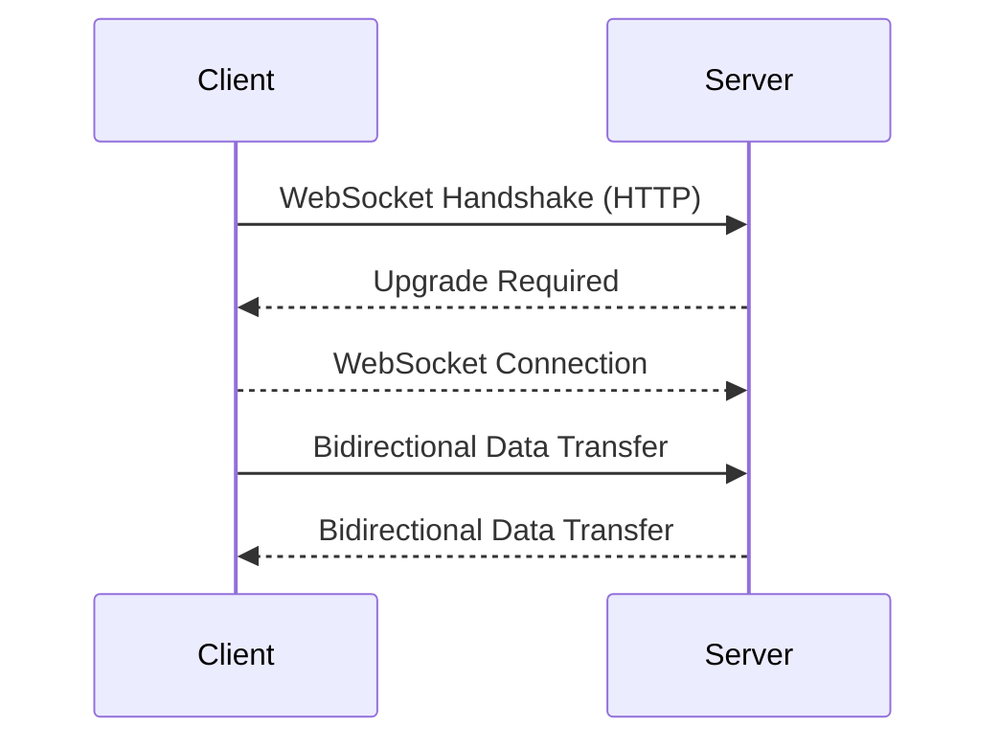

# websockets-article
An article detailing what Websockets are and the options there are to implement them in web applications

```mermaid
sequenceDiagram
    participant Client
    participant Server

    Client ->> Server: WebSocket Handshake (HTTP)
    Server -->> Client: Upgrade Required
    Client -->> Server: WebSocket Connection
    Client ->> Server: Bidirectional Data Transfer
    Server -->> Client: Bidirectional Data Transfer
```
