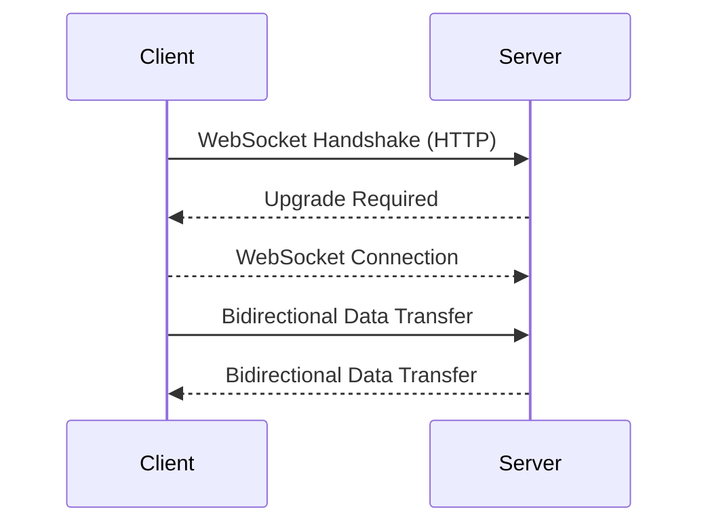

# websockets-article
An article detailing what Websockets are and the options there are to implement them in web applications

# What are WebSockets?
WebSockets are a communication protocol that enables bidirectional, full-duplex communication between clients (such as web browsers) and servers over a single, long-lived TCP connection. They facilitate real-time data exchange and are commonly used in applications that require instant updates and low-latency communication.

