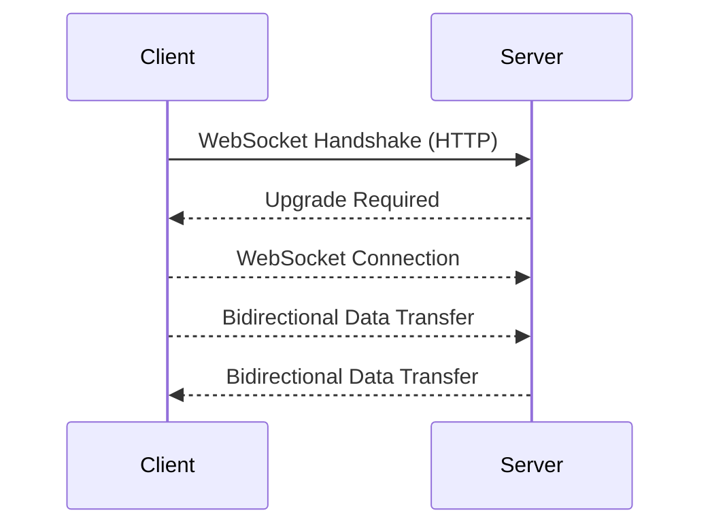
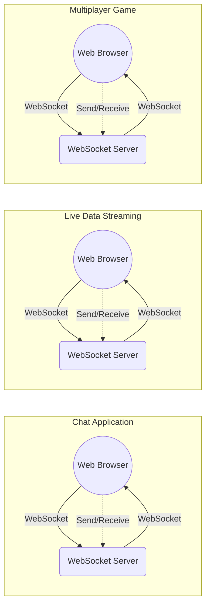

# websockets-article
An article detailing what Websockets are and the options there are to implement them in web applications

# What are WebSockets?
WebSockets are a communication protocol that enables bidirectional, full-duplex communication between clients (such as web browsers) and servers over a single, long-lived TCP connection. They facilitate real-time data exchange and are commonly used in applications that require instant updates and low-latency communication.

1. **WebSocket Handshake (HTTP):** The WebSocket connection begins with a handshake between the client and server, initiated through an HTTP request. This handshake involves negotiating the WebSocket protocol upgrade.
2. **WebSocket Connection:** Once the handshake is completed and the connection is established, the protocol switches to a WebSocket connection. This connection remains open for the duration of the session.
3. **Bidirectional Data Transfer:** With the WebSocket connection established, both the client and server can send messages to each other at any time, without waiting for a request from the other party. This bidirectional communication allows for real-time data exchange.

What are they used for?
WebSockets are employed in various applications requiring real-time communication and low-latency data transfer. Below are some common use cases:

1. **Real-time Chat Applications:** WebSockets are ideal for chat applications where users need to exchange messages instantly. With WebSockets, messages can be sent and received in real-time, providing a seamless chatting experience.
2. **Live Data Streaming:** WebSockets are utilized to stream live data (e.g., stock prices, weather updates) to clients in real-time. This enables users to receive continuous updates without the need to refresh the page.
3. **Multiplayer Online Games:** WebSockets find extensive usage in multiplayer online games to facilitate real-time communication between players and the game server. This allows players to interact with each other and see updates instantly as they occur in the game world.
