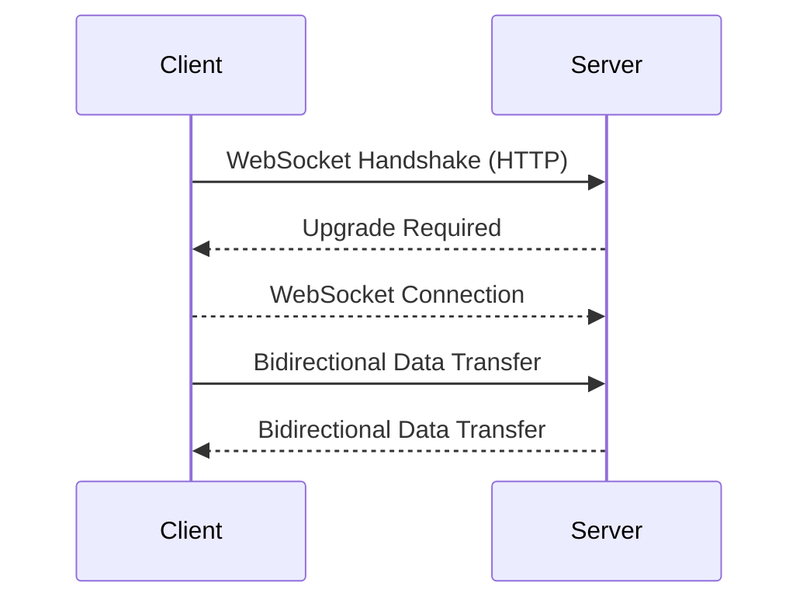

# websockets-article
An article detailing what Websockets are and the options there are to implement them in web applications

# What are WebSockets?
WebSockets are a communication protocol that enables bidirectional, full-duplex communication between clients (such as web browsers) and servers over a single, long-lived TCP connection. They facilitate real-time data exchange and are commonly used in applications that require instant updates and low-latency communication.

1. **WebSocket Handshake (HTTP):** The WebSocket connection begins with a handshake between the client and server, initiated through an HTTP request. This handshake involves negotiating the WebSocket protocol upgrade.
2. **WebSocket Connection:** Once the handshake is completed and the connection is established, the protocol switches to a WebSocket connection. This connection remains open for the duration of the session.
3. **Bidirectional Data Transfer:** With the WebSocket connection established, both the client and server can send messages to each other at any time, without waiting for a request from the other party. This bidirectional communication allows for real-time data exchange.
